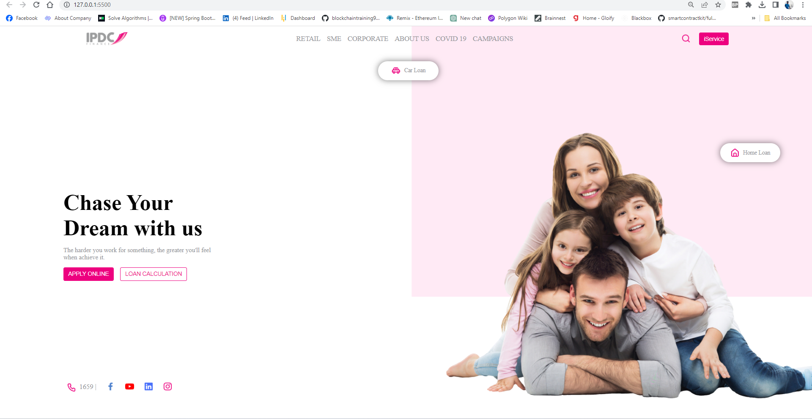

# IDPC Webpage Clone

This project is a clone of the IDPC (Interactive Data Privacy Consent) webpage, created using HTML and CSS. You can view the live demo [here](https://mainak4ever.github.io/idpc-webpage-clone).

## Overview

This project demonstrates the use of HTML and CSS to replicate the user interface of the IDPC webpage. It includes responsive design elements to ensure optimal viewing across various devices and screen sizes.

## Features

- **Responsive Design:** The webpage is optimized for both desktop and mobile devices, ensuring a seamless user experience.
- **Accurate Clone:** The clone closely resembles the design and layout of the original IDPC webpage.
- **Easy to Understand:** The codebase is well-organized and documented, making it easy for developers to comprehend and modify.

## Live Demo

Explore the live demo of the IDPC webpage clone: [IDPC Webpage Clone](https://mainak4ever.github.io/idpc-webpage-clone)

## Screenshots

